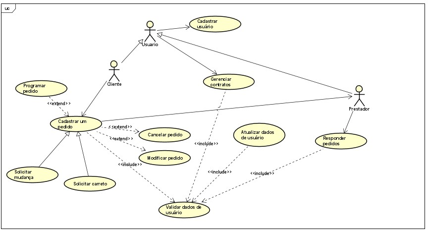

# Especificações do Projeto

Por meio da vivência e dificuldades expostas pelos usuários foi definido pelo grupo o problema a ser solucionado e seus relevantes pontos a serem considerados. Os detalhes apresentados nesse processo foram consolidados no modo de personas e histórias de usuários. 

## Personas

## Alisson Guedes
| **Informações Pessoais** | **Sites e Aplicativos** | **Motivações** |
| --- | --- | --- |
| Idade: 27 anos | Twitter | Já utilizou serviço de carreto para transportar itens grandes que não caberiam em um carro comum |
| Estado Civil: Casado | Youtube | Já utilizou serviço de mudança para mudar de uma casa para outra |
| Naturalidade: Belo Horizonte, MG | Google | Utiliza constantemente este tipo de serviço |
| Tipo de moradia atual: casa alugada | Facebook|Gostaria que um site para solicitação de serviços de carreto ou mudança tivesse busca e filtro de prestadores de serviço por preço, região e disponibilidade, serviço de carregamento e montagem de mobília e garantia de pagamento após o serviço realizado |
| Cidade em que reside atualmente: Belo Horizonte, MG | Instagram | - |
| Formação: Graduação Licenciatura Física | WhatsApp | - |
| Ocupação: Product Owner | - | - |

| **Frustações:**| **Hobbies, História:** |
| --- | --- |
| Dificuldade em encontrar uma pessoa que faça este tipo de serviço quando preciso | Viajar, andar de bicicleta, jogar vídeo game, ler mangás, brincar com os gatos, fazer trilha e cachoeira |
| Valor do serviço muito alto | - |
| Os móveis estragaram durante a mudança | - |
| Falta de disponibilidade do prestador de serviço para auxiliar no descarregamento | - |

## Maria Marta
| **Informações Pessoais** | **Sites e Aplicativos** | **Motivações** |
| --- | --- | --- |
| Idade: 68 anos | Globo Play | Já utilizou várias vezes o serviço de carreto para transportar materiais de construção |
| Estado Civil: separada judicialmente | WhatsApp | Já utilizou duas vezes o serviço de mudança, pois morava de aluguel e teve que mudar de casa |
| Naturalidade: Belo Horizonte, MG | Uber | Gostaria que um site para solicitação de serviços de carreto ou mudança tivesse o nome do motorista que fosse fazer o carreto com a foto dele, nota de avaliação do serviço, um sistema simples e fácil de mexer que mostre a rota do motorista enquanto ele se dirige até a casa e mostrando o horário que ele ia chegar |
| Cidade em que reside atualmente: Belo Horizonte, MG | Facebook | - |
| Formação: Grau técnico | Youtube | - |
| Ocupação: aposentada | - | - |

| **Frustações:**| **Hobbies, História:** |
| --- | --- |
| Preço. Uns cobram um preço muito alto em relação a outros | Colecionar suculentas, cuidar de plantas, fazer caminhada e viajar |
| Os móveis estragaram durante a mudança | - |

## Milena Santos
| **Informações Pessoais** | **Sites e Aplicativos** | **Motivações** |
| --- | --- | --- |
| Idade: 39 anos | WhatsApp | Já utilizou duas vezes o serviço de mudança |
| Estado Civil: Casada | Instagram | Gostaria de ter maior facilidade em encontrar para encontrar uma pessoa ou empresa que realize o serviço de mudança |
| Naturalidade:Brumado, BA | Google | - |
| Tipo de moradia atual: casa | - | - |
| Cidade em que reside atualmente: Belo Horizonte, MG | - | - |
| Formação: 8° Série | - | - |
| Ocupação: Serviços Gerais | - | - |

| **Frustações:**| **Hobbies, História:** |
| --- | --- |
| Carregar os móveis | Viajar, dançar, cuidar da horta, sair para comer e beber, além de curtir a família (tenho 2 filhos, uma neta, três cachorros e uma calopsita)|

## Rafaela Souza
| **Informações Pessoais** | **Sites e Aplicativos** | **Motivações** |
| --- | --- | --- |
| Idade: 27 anos | Netflix | Já utilizou serviço de carreto 5 vezes para levar móveis de uma casa para outra |
| Estado Civil: solteira | WhatsApp | Gostaria que um site para solicitação de serviços de carreto ou mudança tivesse a possibilidade de agendamento prévio de serviço ou contratação num modelo fast (mesmo cm um preço mais alto) para casos de emergência; avaliação de outros clientes sobre o serviço prestado; possibilidade de realizar filtro cm base no tamanho do veículo, bairro, preço e avaliações |
| Naturalidade: Belo Horizonte, MG | Amazon Prime | - |
| Tipo de moradia atual: apartamento próprio | Deezer | - |
| Cidade em que reside atualmente: Belo Horizonte, MG | Instagram | - |
| Formação: Superior Completo | Linkedin | - |
| Ocupação: QA Analyst| Telegram | - |

| **Frustações:**| **Hobbies, História:** |
| --- | --- |
| Dificuldade em contratar o serviço de forma rápida | Viajar, ler e assistir séries |
| Dificuldade em encontrar a oferta dos serviços (poucas informações disponibilizadas na internet e redes sociais), impossibilitando assim uma comparação mais assertiva de preços e avaliações de outros clientes | - |
| Móveis acondicionados de maneira incorreta durante a mudança veículo com espaço insuficiente para o transporte de todos os móveis e objetos | - |

## Thamara Machado
| **Informações Pessoais** | **Sites e Aplicativos** | **Motivações** |
| --- | --- | --- |
| Idade: 29 anos | Youtube | Já utilizou serviço de carreto para mudança de casa |
| Estado Civil: Casada | WhatsApp | Gostaria que um site para solicitação de serviços de carreto ou mudança tivesse valor do serviço, dados do prestador do serviço, acompanhamento do trajeto e previsão do horário de chegada, possibilidade de auxílio para retirada dos móveis e de informar que será necessário subir escadas para entrega dos móveis |
| Naturalidade: Belo Horizonte, MG | Amazon Prime | - |
| Cidade em que reside atualmente: Belo Horizonte, MG | Instagram | - |
| Formação: Superior em andamento | Linkedin | - |
| Ocupação: Analista de Projetos | Uber| - |

| **Frustações:**| **Hobbies, História:** |
| --- | --- |
| Dificuldade para encontrar um prestador de forma rápida e segura | Viajar, andar de bicicleta, andar de patins fazer trilha, cachoeira, cinema, sair para comer, curtir a família e os animais de estimação (3 gatos), cuidar de plantas e mexer com artesanato e marcenaria |
| Falta de cuidado com os móveis, alguns chegaram a estragar | - |
| Falta de auxílio no momento de descarregar o carreto | - |
	
## Histórias de Usuários

Com base na análise das personas foram identificadas as seguintes histórias de usuários:

|EU COMO... `PERSONA`| QUERO/PRECISO ... `FUNCIONALIDADE` |PARA ... `MOTIVO/VALOR`                 |
|--------------------|------------------------------------|----------------------------------------|
|Thamara| ter a opção de informar se preciso de ajuda para descarregar os itens que serão entregues| que quando a entrega for feita, o prestador de serviço já esteja ciente de que será necessário fazer o descarregamento|
|Alisson| ter a opção de solicitar serviço de montagem| que quando a entrega for feita, o prestador de serviço já realize a montagem do móvel|
|Thamara| ter a opção de informar se será necessário subir escadas para realizar a entrega| que quando a entrega seja feita, o prestador de serviço já esteja ciente de que será necessário subir escadas|
|Rafaela| ter a opção de agendar um serviço de carreto/mudança| que na data e horário desejados o prestador de serviços esteja disponível para realização do serviço|
|Rafaela| ter a opção de visualizar o valor do frete que será cobrado para realização do carreto/mudança| que no momento da contratação do serviço eu já esteja ciente do valor que será cobrado|
|Maria Marta| ter a opção de visualizar os dados do prestador de serviço| antes de realizar a contratação, eu possa realizar a avaliação do prestador|
|Maria Marta| ter a opção de visualizar a classificação e comentários do prestador de serviço| que antes da contratação, eu possa avaliar o prestador de serviços|
|Alisson| ter a opção de conversar com o prestador de serviços através do próprio site| que possa obter mais informações do prestador quando for necessário|
|Rafaela| ter a opção de buscar o prestador de serviços através de filtros: valor, tipo de veículo, ajuda no descarregamento, realiza montagem| que possa escolher o prestador de serviço que melhor se adeque a minha necessidade|
|Maria Marta| ter a opção de acompanhar o andamento do meu pedido| que eu possa acompanhar o status do serviço|
|Thamara| ter a opção de visualizar todos os serviços já contratados pelo site| que quando necessário eu possa consultar as informações desses serviços|
|Alisson| ter a opção de informar o local de retirada e entrega do (s) item (s) que serão transportados| que o item (s) sejam retirados e entregados no local correto|
|Alisson| ter a opção de informar quais itens serão transportados| antes de realizar a contratação o prestador já esteja ciente do que será transportado|

## Requisitos

Ao começar um projeto todos os requisitos devem ser levantados, entendidos e documentado. O escopo deste projeto é definido por meio de requisitos funcionais, que são as características que definem os critérios de aceitação do produto e a necessidade do cliente, e requisitos não funcionais que é voltado pelas características de qualidade que o sistema todo ou uma funcionalidade em específico deve ter. A seguir estes requisitos são apresentados. 

### Requisitos Funcionais

A tabela a seguir apresenta os requisitos do projeto, identificando a prioridade em que os mesmos devem ser entregues. 

|ID    | Descrição do Requisito                                                                       | Prioridade |
|------|----------------------------------------------------------------------------------------------|------------|
|RF-01| O site deve permitir ao usuário fazer login | ALTA       | 
|RF-02| O site deve permitir cadastrar usuário cliente                        | ALTA      |
|RF-03| O site deve permitir cadastrar usuário prestador de serviços                                    |  ALTA      |
|RF-04| O site deve permitir o usuário cliente solicitar um serviço                                  | ALTA       |
|RF-05| O site deve permitir o usuário cliente selecionar se será um serviço de carreto ou de mudança                          |  ALTA      |
|RF-06| O site deve permitir o usuário cliente descrever a mercadoria a ser transportada.                                |  ALTA     |
|RF-07| O site deve permitir o usuário prestador fornecer orçamento do serviço.                                |  ALTA      |
|RF-08| O site deve permitir ao usuário cliente finalizar o pedido.                                           |  ALTA      |
|RF-09| O site deve permitir aos usuários visualizar os pedidos em andamento.                                          | MÉDIA      |
|RF-010| O site deve permitir o usuário prestador visualizar solicitações de usuários cliente.                                               | MÉDIA      |
|RF-011| O site deve permitir aos usuários visualizar o histórico de pedidos finalizados.                                           | BAIXA      |
|RF-012| O site deve mostrar ao usuário cliente um resumo do pedido.                                      | BAIXA      |
|RF-013| O site deve permitir ao usuário alterar dados cadastrais.                                      | BAIXA      |
|RF-014|  O site deve permitir o usuário prestador cancelar um pedido.                                 | BAIXA      |
|RF-015|  O site deve permitir o usuário cliente cancelar um pedido.                                 | BAIXA      |

### Requisitos não Funcionais

|ID     | Descrição do Requisito  |Prioridade |
|---------|-------------------------|----|
|RNF-01   | O sistema deve ser compatível com os principais navegadores como (Google Chrome, Mozilla Firefox, Microsoft Edge, Internet Explorer   | ALTA | 
|RNF-02  | O site deve ser publicado em um ambiente acessível publicamente na Internet (Repl.it, GitHub Pages, Heroku)  |  ALTA | 
|RNF-03  | Os dados do sistema podem ser migrados para qualquer sistema de gerenciamento de banco de dados SQL   |  MEDIA |
|RNF-04  | O site deverá ser responsivo permitindo a visualização em um celular de forma adequada |  MEDIA |
|RNF-05  | As informações cadastrais do cliente devem estar disponíveis apenas para o próprio cliente  |  BAIXA |
|RNF-06  | O site deve aparecer no resultado de pesquisas relacionadas a mudança e carreto  |  BAIXA |

## Restrições

|ID| Restrição                                             |
|--|-------------------------------------------------------|
|RE-01| O projeto deverá ser entregue no final do semestre letivo, não podendo extrapolar a data de 26/06/2022.|
|RE-02| O aplicativo deve se restringir às tecnologias #C no Backend e as básicas da Web no Frontend.       |
|RE-03| A equipe não pode subcontratar o desenvolvimento do trabalho.      |

## Diagrama de Casos de Uso
O diagrama de caso de uso não oferece muitos detalhes, ele não mostra por exemplo a ordem em que os passos são executados. Ele dá uma visão geral do relacionamento entre casos de uso, atores e sistemas. O diagrama aborda as principais ligações entre casos de usos e usuário(ator) e detalham os Requisitos Funcionais identificados na etapa de elicitação , sendo assim o diagrama de caso de uso não é utilizado para requisitos não-funcionais. 

Bonecos palito representam os atores no processo(ex- Cliente, Administrador), e a participação do ator no sistema é modelada com uma linha entre o ator e o caso de uso. Para representar o limite do sistema, desenhe uma caixa em torno do próprio caso de uso. O próprio sistema não pode ser ator do diagrama que o modela. 

Quanto aos casos de uso, eles devem representar as interações dos atores com o sistema, cada tipo é representado por uma forma oval rotulada e as relações são indicadas por linhas que podem ter setas nos casos em que se indica a origem da interação. Os nomes dos casos de uso devem representar verbos no infinitivo de acordo com os objetos que se relacionam os verbos (ex- Efetuar login, Visualizar perfil). Os tipos de relacionamentos maus comuns são associações entre atores e casos de uso, generalização entre atores e entre casos de uso, inclusões e extensões entre casos de uso. 

Os casos de uso que serão implementados neste projeto são: Cadastrar usuário, Cadastrar um pedido, Gerenciar pedido e Responder pedidos. Esses casos de uso foram ilustrados no software ASTAH UML, sugerido no microfundamentos de Engenharia de requisitos e podem ser visto na figura abaixo.

