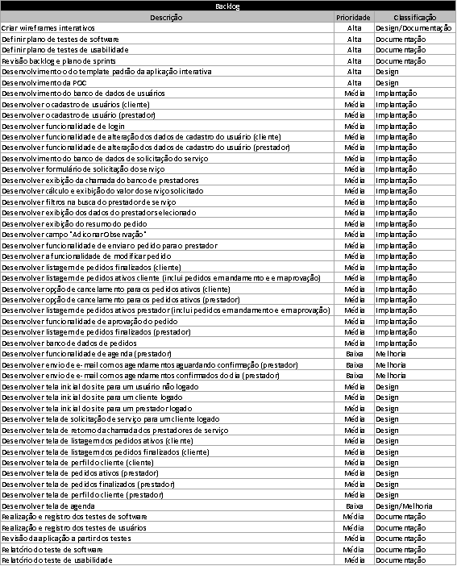
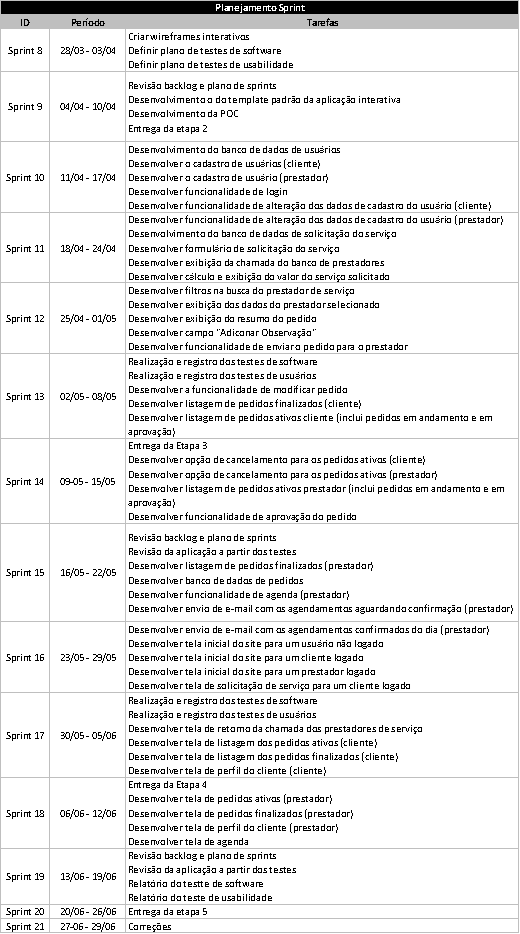
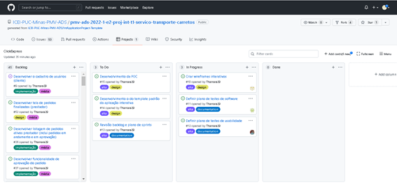
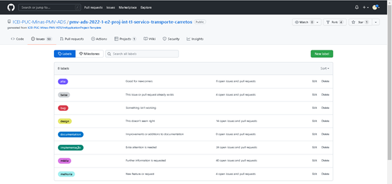

# Backlog

# Plano de Sprints

# Metodologia

Pré-requisitos: <a href="2-Especificação do Projeto.md"> Documentação de Especificação</a>

A metodologia contempla os procedimentos a serem adotados pela equipe, neste item deve ser descrito como o projeto será realizado para o cumprimento e manutenção dos objetivos propostos e mencionado os artefatos para a organização e execução das tarefas no projeto.

## Relação de Ambientes de Trabalho

Os artefatos do projeto são desenvolvidos a partir de diversas plataformas e a relação dos ambientes com seu respectivo propósito é apresentada na tabela que se segue

|Ambiente|Plataformas|Link de Acesso|
|--------|-----------|--------------|
|Repositórios|GitHub|https://github.com/ICEI-PUC-Minas-PMV-ADS/pmv-ads-2022-1-e2-proj-int-t1-servico-transporte-carretos|
|Documentos do Projeto|Google Drive|https://sgapucminasbry.sharepoint.com/:w:/g/personal/1126339_sga_pucminas_br/EeV5cUEOqtROvHriP_aFDpgBBlGeIp2rTwDOwsP-4RzKHg?e=zeXxd4|
|Projeto de Interface e Wireframes|Figma| - |
|Gerenciamento do Projeto|GitHub|[Kanbam ClickExpress](https://github.com/ICEI-PUC-Minas-PMV-ADS/pmv-ads-2022-1-e2-proj-int-t1-servico-transporte-carretos/projects/1)|

## Controle de Versão

A equipe utilizará o Github Classroom para controle de versão.

## Gerenciamento de Projeto

### Divisão de Papéis

Como metodologia a equipe definiu uma abordagem de gerenciamento própria, seguindo a seguinte divisão de papéis:  

#### Equipe de Desenvolvimento

* Kênia Maria da Cunha  
* Sabrina Gonçalves de Andrade 
* Thamara Machado Rocha 
* Werlon Ellem Bicalho de Oliveira

Foram estabelecidos encontros semanais fixos a serem realizados toda segunda-feira, logo após o encontro semanal com o orientador do projeto. 

### Processo

Para o controle, organização e distribuição das tarefas do projeto, a equipe optou por utilizar o sistema de Kanbam disponível no GitHub. O quadro pode ser acessado através do link [Kanbam ClickExpress](https://github.com/ICEI-PUC-Minas-PMV-ADS/pmv-ads-2022-1-e2-proj-int-t1-servico-transporte-carretos/projects/1) e está estruturado da seguinte forma:
* Backlog: recebe as tarefas a serem trabalhadas e representa o Product Backlog. Todas as atividades identificadas no decorrer do projeto também devem ser incorporadas a esta lista;
* To Do: Esta lista representa o Sprint Backlog. Este é o Sprint atual que estamos trabalhando;
* In Progress representa as tarefas que estão em execução naquele momento; e
* Done nesta lista são colocadas as tarefas que passaram pelos testes e controle de qualidade e estão prontos para ser entregues ao usuário. Não há mais edições ou revisões necessárias, ele está agendado e pronto para a ação. 

As tarefas foram ainda classificadas em função da sua natureza e prioridade, conforme imagem abaixo

### Ferramentas

As seguintes ferramentas foram utilizadas durante a elaboração do projeto:

**Editor de Código:** Visual Studio
**Ferramentas de Comunicação:** Microsoft Teams e WhatsApp
**Ferramentas para criação de diagramas:**
**Ferramentas de desenho de tela (wireframing):** Figma 

O editor de código escolhido foi o recomendado pela própria Universidade. 
Para a comunicação, a equipe optou por utilizar o Microsoft Teams para realização dos encontros semanais fixos e o WhatsApp para itens pontuais. 
