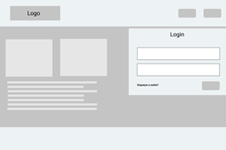

# Projeto de Interface

Pré-requisitos: <a href="2-Especificação do Projeto.md"> Documentação de Especificação</a>

Um projeto de interface envolve o desenvolvimento de protótipos de interfaces. Alguns elementos, tais como usabilidade, consistência, navegabilidade, interatividade, clareza, flexibilidade, funcionalidade e legibilidade, devem ser considerados no processo de produção dessas interfaces.	 

**Diagrama de Fluxo:**  

Conforme pode ser visto, a figura  mostra o diagrama de fluxo de interação do usuário pelas telas do sistema. Cada uma das telas deste fluxo é detalhada na seção de Wireframes que será desenvolvido. 

|FLUXO DO USUÁRIO| DESCRIÇÃO  |REFERÊNCIA                |
|--------------------|--------------------------------------------|----------------------------------------|
|HomePage           | A página inicial da aplicação será responsável por apresentar as funcionalidades principais        |  |
|Cadastro Cliente e Prestador de Serviços | Permitir ao usuário realizar o cadastro na aplicação como: cadastro de usuário cliente ou cadastro de prestador de serviço (PF/Autônomo)   | RF02 e RF03           |
| Login                   | Permitir ao usuário efetuar o login incluindo o email e senha.     |  RF01                                      |
|Solicitação de pedidos do cliente             | Permitir realizar a solicitação, usuário informa o endereço de origem e destino; data e hora que deseja o serviço; informa o tipo: se é carreto ou mudança; informa a listagem e quantidade de itens; escolhe o tipo de veículo de transporte; insere algumas informações tais como: local é de difícil acesso, casa ou apartamento, precisa de ajudante, possui elevador, qual andar, tem escada; informa se quer adicionar o serviço de montagem e desmontagem. Mostra o prestador de serviço que atendem ao filtro já informando seu valor de frete. Apresenta as informações do prestador escolhido, o resumo do pedido; caso houver deixar uma mensagem ou observação para o prestador; se necessário é possível modificar o pedido e  finalizar a contratação do pedido. | RF04, RF05, RF06, RF07, RF08, RF012 |
| Histórico do cliente | Permitir ao usuário cliente visualizar os pedidos em andamento e visualizar os pedidos finalizados. Permitir cancelar um pedido.      | RF09, RF011 e R0F15 |
| Minha área                     | Permitir ao usuário alterar dados cadastrais e alteração da senha.      |  RF013                                      |
| Histórico do Prestador de Serviços                    | Permitir ao usuário cliente visualizar os pedidos em andamento, pedidos finalizados e em aprovação. Permitir cancelar e aceitar um pedido.     |  RF09, RF010, RF011 e RF014                                       |

## Wireframes

##### Estrutura base de todas as páginas do projeto.

Abaixo mostraremos os principais fluxos dos usuários do projeto.

##### Página Inicial -> Cadastro Cliente

##### Página Inicial -> Cadastro Prestador de Serviço

##### Página Inicial -> Login

##### Cliente Logado -> Solicitar Serviço

##### Cliente Logado -> Histórico

##### Cliente Logado -> Minha Área

##### Prestador de Serviço -> Solicitações

##### Prestador de Serviço -> Minha Área

