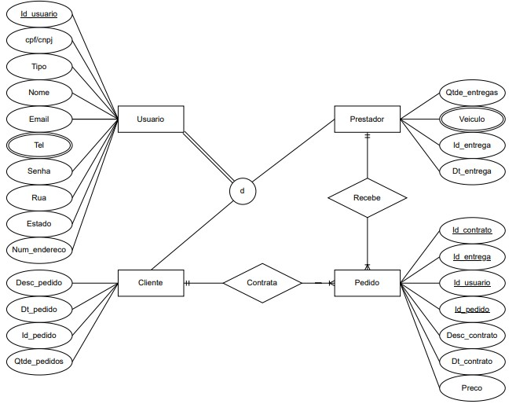

# Arquitetura da Solução

Pré-requisitos: <a href="3-Projeto de Interface.md"> Projeto de Interface</a>

Definição de como o software é estruturado em termos dos componentes que fazem parte da solução e do ambiente de hospedagem da aplicação.

## Diagrama de Classes

Na engenharia de software, um diagrama de classes é um tipo de diagrama de estrutura estática que descreve a estrutura de um sistema mostrando as classes do sistema, seus atributos, operações e os relacionamentos entre os objetos. 

No diagrama, as classes são representadas com caixas que contêm três compartimentos: 
O compartimento superior contém o nome da classe. É impresso em negrito e centralizado, e a primeira letra é maiúscula. 
O compartimento do meio contém os atributos da classe. Eles são alinhados à esquerda e a primeira letra é minúscula. 
O compartimento inferior contém as operações que a classe pode executar. Eles também são alinhados à esquerda e a primeira letra é minúscula. 
Uma classe com três compartimentos.No projeto de um sistema, várias classes são identificadas e agrupadas em um diagrama de classes que ajuda a determinar as relações estáticas entre elas. Na modelagem detalhada, as classes do projeto conceitual são frequentemente divididas em subclasses. 

## Modelo ER

O Modelo ER representa através de um diagrama como as entidades (coisas, objetos) se relacionam entre si na aplicação interativa.]

Na figura abaixo é mostrado o Modelo Relacional(MR) desenvolvido na plataforma "draw.io" para o projeto.

## Esquema Relacional

O Esquema Relacional corresponde à representação dos dados em tabelas juntamente com as restrições de integridade e chave primária.
 
Na figura abaixo é mostrado o Esquema Relacional(ER) desenvolvido no próprio banco de dados para o projeto.

## Tecnologias Utilizadas
As tecnologias usadas para a criação do projeto foram Diagrams.net, SqlServer, DBaver, Visual Studio 2019, usando o framework ASP.NET, criado nas linguagens front-end: HTML, CSS, JavaScript, e back-end: C#.

## Hospedagem
A hospedagem do projeto feita no "GitHub", a do banco de dados utiliza-se o "DBaver" e o banco de dados "SqlServer".
