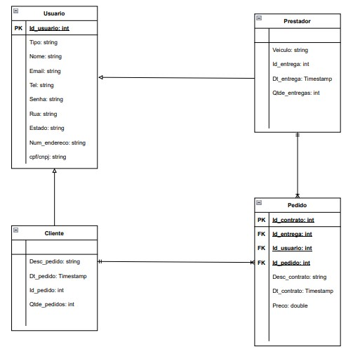

# Arquitetura da Solução

Pré-requisitos: <a href="3-Projeto de Interface.md"> Projeto de Interface</a>

Definição de como o software é estruturado em termos dos componentes que fazem parte da solução e do ambiente de hospedagem da aplicação.

## Diagrama de Classes

Na engenharia de software, um diagrama de classes é um tipo de diagrama de estrutura estática que descreve a estrutura de um sistema mostrando as classes do sistema, seus atributos, operações e os relacionamentos entre os objetos. 

No diagrama, as classes são representadas com caixas que contêm três compartimentos: 
O compartimento superior contém o nome da classe. É impresso em negrito e centralizado, e a primeira letra é maiúscula. 
O compartimento do meio contém os atributos da classe. Eles são alinhados à esquerda e a primeira letra é minúscula. 
O compartimento inferior contém as operações que a classe pode executar. Eles também são alinhados à esquerda e a primeira letra é minúscula. 
Uma classe com três compartimentos.No projeto de um sistema, várias classes são identificadas e agrupadas em um diagrama de classes que ajuda a determinar as relações estáticas entre elas. Na modelagem detalhada, as classes do projeto conceitual são frequentemente divididas em subclasses. 

## Modelo ER

O Modelo ER representa através de um diagrama como as entidades (coisas, objetos) se relacionam entre si na aplicação interativa.]

As referências abaixo irão auxiliá-lo na geração do artefato “Modelo ER”.

> - [Como fazer um diagrama entidade relacionamento | Lucidchart](https://www.lucidchart.com/pages/pt/como-fazer-um-diagrama-entidade-relacionamento)

Na figura abaixo é mostrado o Modelo Relacional(MR) desenvolvido na plataforma "draw.io" para o projeto.

## Esquema Relacional

O Esquema Relacional corresponde à representação dos dados em tabelas juntamente com as restrições de integridade e chave primária.
 
As referências abaixo irão auxiliá-lo na geração do artefato “Esquema Relacional”.

> - [Criando um modelo relacional - Documentação da IBM](https://www.ibm.com/docs/pt-br/cognos-analytics/10.2.2?topic=designer-creating-relational-model)

Na figura abaixo é mostrado o Esquema Relacional(ER) desenvolvido na plataforma "draw.io" para o projeto.

## Tecnologias Utilizadas

Descreva aqui qual(is) tecnologias você vai usar para resolver o seu problema, ou seja, implementar a sua solução. Liste todas as tecnologias envolvidas, linguagens a serem utilizadas, serviços web, frameworks, bibliotecas, IDEs de desenvolvimento, e ferramentas.

Apresente também uma figura explicando como as tecnologias estão relacionadas ou como uma interação do usuário com o sistema vai ser conduzida, por onde ela passa até retornar uma resposta ao usuário.

## Hospedagem

Explique como a hospedagem e o lançamento da plataforma foi feita.

> **Links Úteis**:
>
> - [Website com GitHub Pages](https://pages.github.com/)
> - [Programação colaborativa com Repl.it](https://repl.it/)
> - [Getting Started with Heroku](https://devcenter.heroku.com/start)
> - [Publicando Seu Site No Heroku](http://pythonclub.com.br/publicando-seu-hello-world-no-heroku.html)
