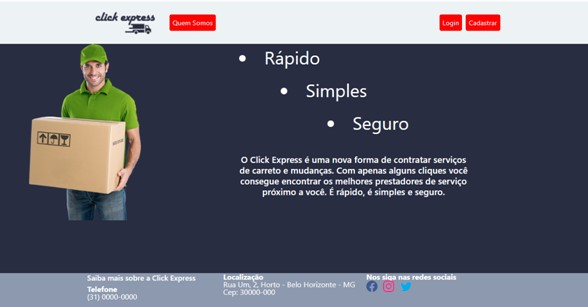
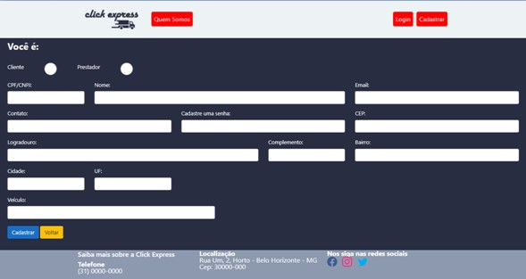
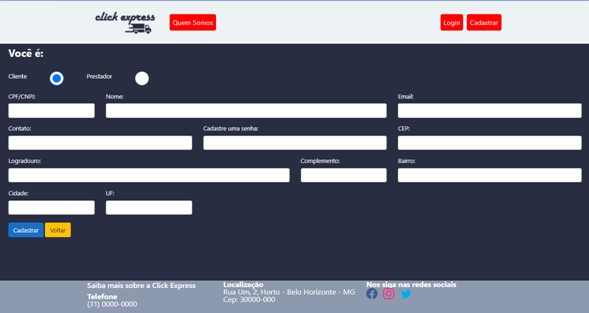
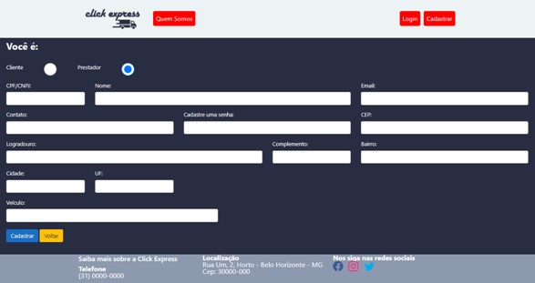
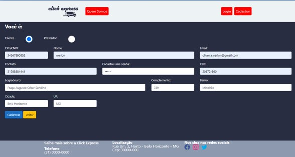
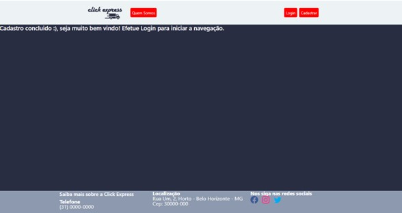
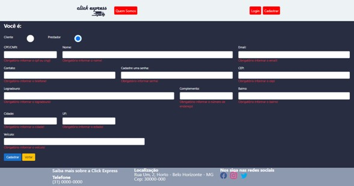
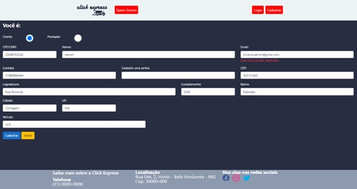

# Registro de Testes de Software

 

# Tela inicial
 

 

# CT-01 – Cadastro do usuário

 

 

 

 

 

 

 

# CT-02 – Login do usuário

# CT-04 – Usuário Cliente fazer um pedido (solicitar um serviço de carreto ou mudança)
