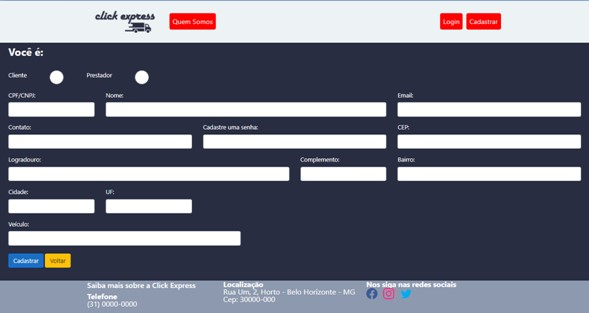
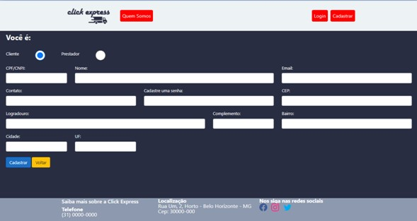
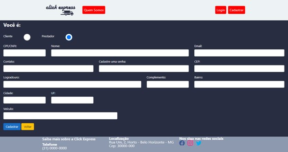
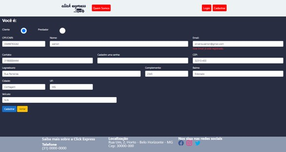

# Registro de Testes de Usabilidade

 

## CT-01 – Prevenir erros

 

 

 

## CT-02 – Fornecer feedbacks informativos e marcar o final dos diálogos

 

 

## CT-03 – Usuário reconhecer, diagnosticar e recuperar seus erros

 

 
